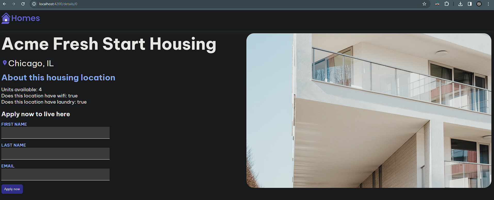

# Hello Angular

Simple Hello World angular, using a simple JSON server for data.

To get the application running, follow these steps:

1. **Start the JSON server**  
   First, you need to run the JSON server to serve your mock database. Open a terminal and execute the following command:
   ```bash
   json-server --watch db.json
   ```
2. **Run the Angular App**  
   Next, open a new terminal window or tab and run the Angular application with the following command:
   ```bash
   ng serve
   ```


